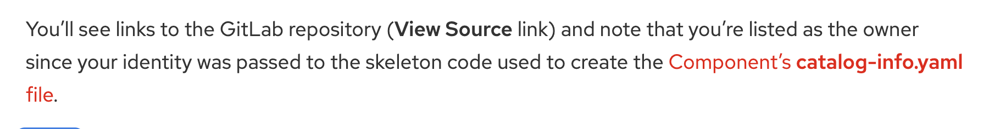
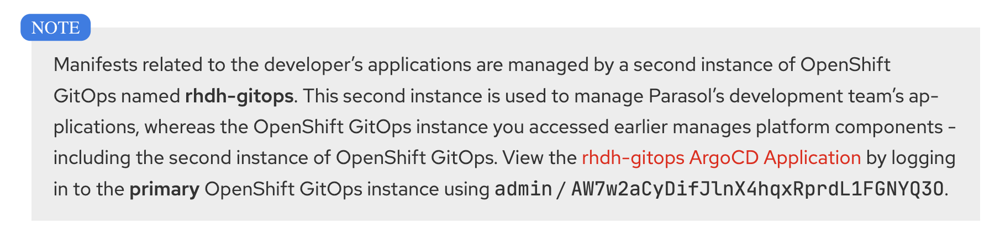
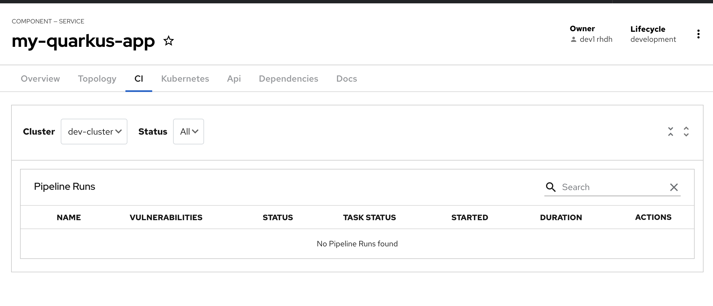
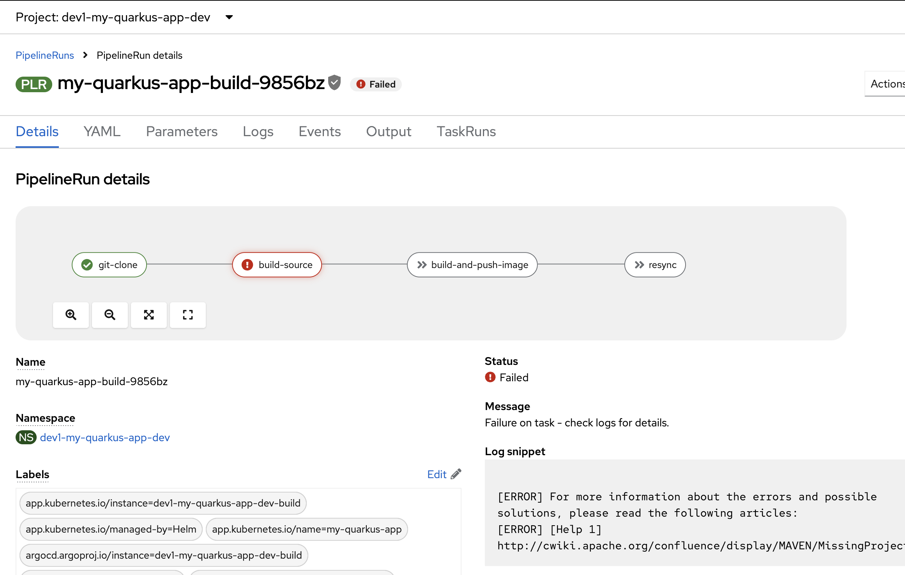
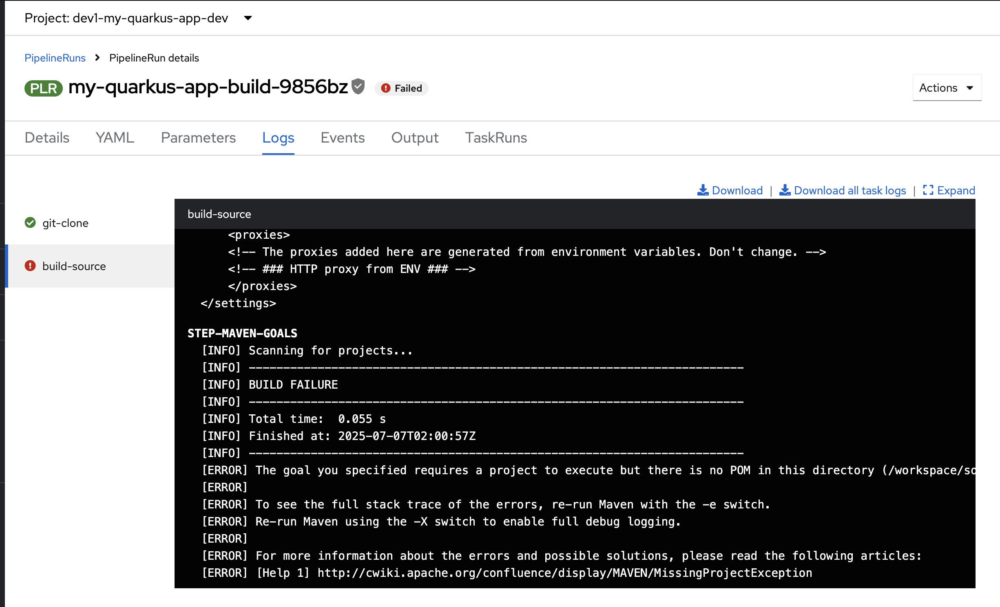

# Platform Engineering WorkShop

##Issues

**Platform Engineering Workshop
	/ 3. Test drive Red Hat Developer Hub
	/ 3.4 Developer Activity: Create a new Component from the Template**

- Link is not correct:

	Platform Engineering Workshop
	/ 3. Test drive Red Hat Developer Hub
	/ 3.4 Developer Activity: Create a new Component from the Template
	
	
	
	Click on the link shows error with this url:
	```
	https://showroom-showroom.apps.cluster-z6kkw.z6kkw.sandbox977.opentlc.com/
	```

	
	
- Pipeline is not ran automatically and when run it manually from OCP console, the following error:

	
	
	
	
	
- error running git clone:


	```
	Running Script /scripts/prepare.sh
---> Phase: Preparing the filesystem before cloning the repository...
---> Phase: Deleting all contents of checkout-dir '/workspace/output/'...
Running Script /scripts/git-run.sh
---> Phase: Setting output workspace as safe directory ('/workspace/output')...
---> Phase: Setting up HTTP_PROXY=''...
---> Phase: Settting up HTTPS_PROXY=''...
---> Phase: Setting up NO_PROXY=''...
---> Phase: Cloning 'https://gitlab-gitlab.apps.cluster-z6kkw.z6kkw.sandbox977.opentlc.com/dev1/my-quarkus-app.git' into '/workspace/output/'...
+ exec git-init -url=https://gitlab-gitlab.apps.cluster-z6kkw.z6kkw.sandbox977.opentlc.com/dev1/my-quarkus-app.git -revision=main -refspec= -path=/workspace/output/ -sslVerify=true -submodules=true -depth=1 -sparseCheckoutDirectories=
{"level":"error","ts":1751854009.8263304,"caller":"git/git.go:53","msg":"Error running git [remote get-url origin]: exit status 2\nerror: No such remote 'origin'\n","stacktrace":"github.com/tektoncd-catalog/git-clone/git-init/git.run\n\t/go/src/github.com/tektoncd-catalog/git-clone/image/git-init/git/git.go:53\ngithub.com/tektoncd-catalog/git-clone/git-init/git.Fetch\n\t/go/src/github.com/tektoncd-catalog/git-clone/image/git-init/git/git.go:109\nmain.main\n\t/go/src/github.com/tektoncd-catalog/git-clone/image/git-init/main.go:52\nruntime.main\n\t/usr/lib/golang/src/runtime/proc.go:272"}
{"level":"info","ts":1751854010.7249703,"caller":"git/git.go:186","msg":"Successfully cloned https://gitlab-gitlab.apps.cluster-z6kkw.z6kkw.sandbox977.opentlc.com/dev1/my-quarkus-app.git @ b37feae23905db41ece20fd2a1da993251f6d5a0 (grafted, HEAD, origin/main) in path /workspace/output/"}
{"level":"info","ts":1751854011.2288914,"caller":"git/git.go:225","msg":"Successfully initialized and updated submodules in path /workspace/output/"}
Running Script /scripts/report.sh
---> Phase: Collecting cloned repository information ('/workspace/output/')...
---> Phase: Setting output workspace as safe directory ('/workspace/output')...
---> Phase: Reporting last commit date '1751852399'...
---> Phase: Reporting parsed revision SHA 'b37feae23905db41ece20fd2a1da993251f6d5a0'...
---> Phase: Reporting repository URL 'https://gitlab-gitlab.apps.cluster-z6kkw.z6kkw.sandbox977.opentlc.com/dev1/my-quarkus-app.git'...

	```

